  <a href="https://drmarionascimento.github.io/DrMarioNascimento/"><b>🪐 Entrar no universo interativo · Enter the interactive universe →</b></a>

---

### 🇧🇷 Olá, eu sou o Prof. Mário César Nascimento, PhD

Professor universitário de **Fisiologia** (Educação Física e Fisioterapia), **Ética** e **formação em pesquisa acadêmica**. Uso código para transformar conteúdos difíceis em experiências que o aluno pode explorar, testar e errar com segurança.

**Rigor científico primeiro, didática a serviço dele.** Nas horas livres (e no futuro), crio jogos de dedução e investigação no **Dragon Games**.

### 🇺🇸 Hi, I'm Prof. Mário César Nascimento, PhD

University professor of **Physiology** (Physical Education and Physiotherapy), **Ethics** and **research training**. I write code to turn hard concepts into experiences students can explore, test and get wrong safely.

**Scientific rigor first, teaching in its service.** On the side (and, I hope, the future), I design deduction and investigation games at **Dragon Games**.

---

**Estado em 7 de outubro de 2026.** Onze repositórios. As licenças são de uso restrito ou proprietárias: repositório público não é código aberto. A demo no GitHub Pages não autoriza cópia, adaptação nem uso comercial por terceiros.

| | Projeto · Project | O que é · What it is |
|---|---|---|
| 🫀 | [**Fisiologia Interativa**](https://drmarionascimento.github.io/fisiologia-interativa/) | Simuladores de fisiologia humana · Human physiology simulators |
| 🔐 | [**Fisiologia em Fuga**](https://drmarionascimento.github.io/fisiologia-em-fuga/) | Escape rooms por unidade · Unit-by-unit escape rooms |
| ⏱️ | [**Atividades Extras**](https://drmarionascimento.github.io/Atividades-Extras/) | Operações de sala em equipe · Team classroom operations |
| ⚖️ | [**Ética Interativa**](https://drmarionascimento.github.io/Etica/) | Ética por cenários de decisão · Ethics through decisions |
| 🔬 | [**Laboratório do Pesquisador**](https://drmarionascimento.github.io/Learning-lab/) | Metodologia de pesquisa, mobile-first · Research methods labs |
| 🐉 | [**Dragon Games**](https://drmarionascimento.github.io/Dragon/) | Jogos de dedução e investigação · Deduction & investigation games |
| 🃏 | [**Mosaico Card**](https://drmarionascimento.github.io/Mosaico-Card/) | Jogo de cartas e pistas · Card-and-clue game |
| 🥽 | [**Lab RA**](https://drmarionascimento.github.io/lab-ra/) | Realidade aumentada no navegador · Browser-based AR |
| ⚔️ | [**Eita!**](https://eita-quiz.web.app/) | Quiz-batalha de sala · Classroom boss-battle quiz (repositório privado) |
| 🥗 | [**NutriCiclos — manual**](https://github.com/DrMarioNascimento/NutriCiclos-manual) | Manual da clínica · Clinic manual. O sistema não está neste perfil |

HTML · CSS · JavaScript · SVG · WebGL — pensado para rodar no celular do aluno · built to run on a student's phone.

Página deste perfil: [drmarionascimento.github.io/DrMarioNascimento](https://drmarionascimento.github.io/DrMarioNascimento/). O visual da página é de demonstração. Todos os direitos reservados ao autor.
